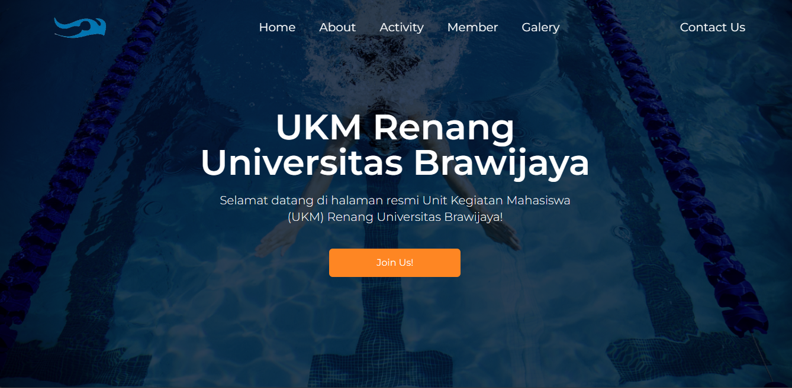

# [💻 UKM Renang Universitas Brawijaya Website](https://next-ukm.vercel.app/)

UKM Renang Universitas Brawijaya Website is a comprehensive online platform designed to showcase and facilitate engagement with the activities, members, and initiatives of the Swimming Unit at Universitas Brawijaya. This website serves as a dynamic and informative hub for both existing members and individuals interested in joining or learning more about the swimming unit.

## 📸 Showcase
<p align="center">
<br>
</p>

## Features
* Responsive Design: The website is designed to be responsive, ensuring a seamless experience across various devices.
* Navigation: Intuitive navigation allows users to explore different sections of the website easily.
* Dynamic Content: Content is dynamically loaded using Next.js, providing a smooth and efficient user experience.
* Gallery: A gallery section showcases various events and activities organized by the swimming unit.
* Member Section: Information about the unit's members, including their roles and photos, is displayed in an organized manner.
* Contact Form: Users can easily reach out to the UKM Renang Universitas Brawijaya through a contact form.

## Built With
* [![Node][Node.js]][Node-url]
* [![Typescript][Typescript]][Typescript-url]
* [![Next][Next.js]][Next-url]
* [![React][React.js]][React-url]
* [![Tailwind][Tailwind-css]][Tailwind-url]

## Getting Started

### Prerequisites

* npm
  ```sh
  npm install npm@latest -g
  ```

### Installation

1. Clone the repo
   ```sh
   git clone https://github.com/fikrihaikal20/next-ukm.git
   ```
2. Install NPM packages
   ```sh
   npm install
   ```

First, run the development server:

```bash
npm run dev
# or
yarn dev
# or
pnpm dev
# or
bun dev
```

Open [http://localhost:3000](http://localhost:3000) with your browser to see the result.

This project uses [`next/font`](https://nextjs.org/docs/basic-features/font-optimization) to automatically optimize and load Montserrat, a custom Google Font.

## Deploy on Vercel

The easiest way to deploy your Next.js app is to use the [Vercel Platform](https://vercel.com/new?utm_medium=default-template&filter=next.js&utm_source=create-next-app&utm_campaign=create-next-app-readme) from the creators of Next.js.

Check out our [Next.js deployment documentation](https://nextjs.org/docs/deployment) for more details.

<!-- MARKDOWN LINKS & IMAGES -->
<!-- https://www.markdownguide.org/basic-syntax/#reference-style-links -->
[Node.js]: https://img.shields.io/badge/Node%20Js-20232A?style=for-the-badge&logo=nodedotjs
[Node-url]: https://nodejs.org/en
[Typescript]: https://img.shields.io/badge/Typescript-20232A?style=for-the-badge&logo=typescript
[Typescript-url]: https://www.typescriptlang.org/
[Next.js]: https://img.shields.io/badge/next.js-20232A?style=for-the-badge&logo=nextdotjs&logoColor=white
[Next-url]: https://nextjs.org/
[React.js]: https://img.shields.io/badge/React-20232A?style=for-the-badge&logo=react&logoColor=61DAFB
[React-url]: https://reactjs.org/
[Tailwind-css]: https://img.shields.io/badge/Tailwind-20232A?style=for-the-badge&logo=tailwindcss&logoColor=61DAFB
[Tailwind-url]: https://tailwindcss.com/

